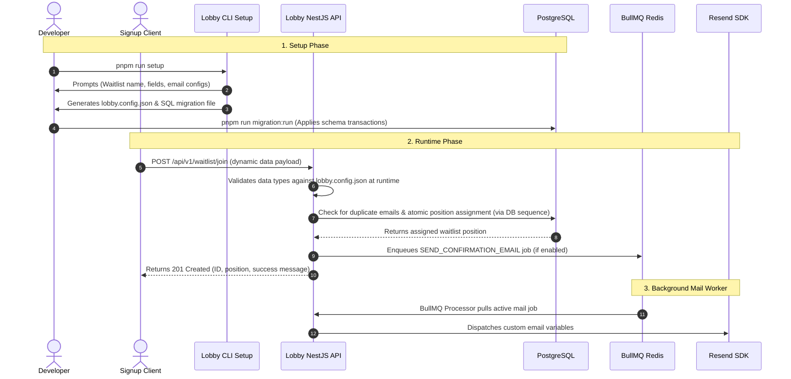

# 🚀 Lobby

<p align="center">
  <strong>The self-hosted, headless waitlist API. Define custom schemas in seconds, own your data, and deploy anywhere.</strong>
</p>

<p align="center">
  <a href="#-quick-start"></a>
  <a href="https://github.com/josephsystems/lobby/blob/main/LICENSE"></a>
  <a href="https://nodejs.org"></a>
  <a href="https://pnpm.io"></a>
</p>

---

## ⚡ What is Lobby?

Lobby is an open-source, developer-first, self-hosted waitlist backend. Traditional waitlist SaaS platforms lock your data behind their subscription models, enforce rigid fields, and limit customizations. Lobby solves this by giving you:

- **Complete Data Ownership**: Your signups live entirely in your own PostgreSQL database.
- **100% Headless & Customizable**: Define your waitlist's name and schema with an interactive wizard, plug it into your custom frontend, and walk away.
- **Instant Deployments**: Go from a blank terminal to a fully functional, production-ready waitlist API in less than **5 minutes**.
- **Zero Data Loss Migrations**: Safely add, modify, or remove signup fields post-launch using automatically generated SQL migrations.

---

## 🛠️ Tech Stack & Architecture

Lobby is engineered with high-performance, industry-standard modern web technologies:

- **Framework**: [NestJS 11](https://nestjs.com/) — reliable, scalable, and highly structured.
- **Database Interface**: [Kysely](https://kysely.dev/) — ultra-fast, SQL-injection safe, and fully type-safe dynamic SQL compiler.
- **Data Layer**: [PostgreSQL](https://www.postgresql.org/) — robust relational database.
- **Queuing & Workers**: [BullMQ](https://bullmq.io/) & [Redis](https://redis.io/) — transactional mail queuing for heavy signup loads.
- **Communications**: [Resend](https://resend.com/) — modern developer-friendly transactional email service.
- **CLI Wizard**: [Clack (`@clack/prompts`)](https://github.com/clackjs/clack) — beautiful, interactive console prompts.

### 📐 How Lobby Works



---

## ⚡ Quick Start (Under 5 Minutes)

Deploying your waitlist backend is straightforward. Ensure you have **Node.js (>=22.0.0)** and **pnpm (>=10.33.4)** installed. _(Note: A PostgreSQL database instance is only required starting at Step 4)._

### 1. Clone & Install Dependencies

```bash
git clone https://github.com/josephsystems/lobby.git && cd lobby && pnpm install
```

### 2. Run the Interactive Setup Wizard

```bash
pnpm run setup
```

This command generates:

- `lobby.config.json` — the source of truth for your waitlist schema.
- `migrations/{timestamp}_initial_setup.sql` — a custom SQL migration mapping your fields directly into PostgreSQL.

### 3. Configure Environment Variables

Copy the template `.env.example` to `.env` and configure your credentials:

```bash
cp .env.example .env
```

> [!NOTE]
> **Resend Template Variables**: Your Resend template will receive the following variables dynamically:
>
> - `email`: The signup's email address.
> - `position`: The signup's queue position (integer).
> - Any custom fields configured in `lobby.config.json` (e.g., `first_name`, `last_name`, etc.).

### 4. Run Migrations

Apply the migration files to construct your custom database tables:

```bash
pnpm run migration:run
```

### 5. Start Lobby

Start the NestJS development server:

```bash
pnpm run start:dev
```

Your waitlist API is now active at `http://localhost:3000/api/v1`! 🚀

---

## 🔌 API Reference

### 1. Join the Waitlist

Submits a signup request. Dynamic fields are added to `fields` and validated against the schema defined in `lobby.config.json`.

- **Route**: `POST /api/v1/waitlist/join`
- **Content-Type**: `application/json`

#### Example Payload:

```json
{
  "email": "developer@example.com",
  "fields": {
    "first_name": "Ada",
    "last_name": "Lovelace",
    "phone": "+2348000000000"
  }
}
```

#### Successful Response (`201 Created` for new signups):

```json
{
  "status": "success",
  "data": {
    "id": "2e6b223c-f4e1-456b-be39-2a912bb0e7b8",
    "email": "developer@example.com",
    "position": 42,
    "message": "You're on the list!",
    "isNew": true
  }
}
```

#### Idempotency Check (`200 OK` for existing emails):

Submitting the same email again is safe and returns the user's existing queue position:

```json
{
  "status": "success",
  "data": {
    "id": "2e6b223c-f4e1-456b-be39-2a912bb0e7b8",
    "email": "developer@example.com",
    "position": 42,
    "message": "You're already on the list!",
    "isNew": false
  }
}
```

---

### 2. Query Waitlist Position

Retrieves a user's current place in the waitlist queue.

- **Route**: `GET /api/v1/waitlist/position`
- **Query Parameters**:
  - `email` (string, required)

#### Example Request:

```http
GET /api/v1/waitlist/position?email=developer@example.com
```

#### Successful Response (`200 OK`):

```json
{
  "status": "success",
  "data": {
    "message": "Successfully retrieved position.",
    "email": "developer@example.com",
    "position": 42
  }
}
```

---

## 🔒 Security & CORS

Lobby is a public-facing API but contains rigorous protection to prevent malicious third parties from spamming your backend from random origins:

- **Origin Restriction**: Lobby dynamically compiles regular expressions from the `APP_DOMAIN` env variable.
- **CORS Behavior**:
  - **Production (`NODE_ENV=production`)**: Strictly allows requests only from `https://yourproduct.com` and its HTTPS subdomains.
  - **Staging**: Allows standard localhost routes plus your secure production domains.
  - **Development**: Automatically permits localhost ports (`http://localhost:*`).

## 📦 Deployment Options

To deploy Lobby, you will need a **PostgreSQL Database** and (optionally) a **Redis Instance** (required only if `email is enabled in lobby.config.json`) for BullMQ queues and rate limiting.

---

### 🗄️ Step 1: Provision Core Services

#### 1. PostgreSQL Database

Choose one of the following providers:

- **Supabase (Free/Managed)**: Create a project at [Supabase](https://supabase.com). Copy the PostgreSQL transaction/session connection string from Database Settings.
- **Neon (Free/Managed)**: Create a serverless database at [Neon](https://neon.tech), which is excellent for serverless environments.
- **Self-Hosted / VPS**: Run PostgreSQL natively or via Docker.

#### 2. Redis Instance (Optional)

Required only if `email is enabled in lobby.config.json`.

- **Upstash (Free/Managed)**: Serverless Redis with a generous free tier. Create one at [Upstash](https://upstash.com).
- **Aiven (Free/Managed)**: Managed Redis with a free tier. Create one at [Aiven](https://aiven.io).
- **Redis (Free/Managed)**: Managed Redis with a free tier. Create one at [Redis](https://redis.io).
- **Self-Hosted / VPS**: Run Redis natively or via Docker.

---

### 🚀 Step 2: Choose Your Hosting Provider

#### Option A: Railway (PaaS)

Railway is a fast way to host your app, PostgreSQL, and Redis in one dashboard.

1. Create a new project in Railway.
2. Connect the GitHub repository.
3. Add **PostgreSQL** and **Redis** (if using emails or want Throttle to use redis) database services to your project.
4. Link your database and Redis connection details to Lobby's environment variables.
5. Deploy! Railway will automatically detect Node.js, run your build script, and expose the application port.

#### Option B: Render (PaaS)

Render is a developer-friendly platform for web services and databases.

1. Create a **PostgreSQL** and **Redis** (if using emails or want Throttle to use redis) database on Render.
2. Create a new **Web Service** on Render and connect your GitHub repository.
3. Set the build and start commands:
   - **Build Command:** `pnpm run build`
   - **Start Command:** `pnpm run start:prod`
4. Configure your environment variables in the Render dashboard.
5. Deploy!

#### Option C: Vercel (Serverless)

Lobby can be deployed as serverless functions on Vercel.

1. Connect the repository to Vercel.
2. Set up the required environment variables.
3. Deploy!
   > [!NOTE]
   > Ensure you use serverless-compatible database and Redis connections (like Neon and Upstash) that handle connection pooling efficiently.

#### Option D: VPS & Self-Hosted (Docker Compose)

Perfect if you want full ownership on your own server (DigitalOcean, Hetzner, AWS, etc.).

Lobby includes a `docker-compose.yml` that configures the API, PostgreSQL, and Redis automatically. To start:

```bash
docker-compose up -d --build
```

Lobby will spin up, automatically run pending migrations, and listen on port `3000`.

---

### ⚙️ Required Environment Variables

When deploying, ensure the following variables are configured on your host:

| Variable                          | Description                                                        | Required?                                        |
| :-------------------------------- | :----------------------------------------------------------------- | :----------------------------------------------- |
| `DATABASE_URL`                    | PostgreSQL connection string                                       | **Yes**                                          |
| `APP_DOMAIN`                      | Frontend application domain (for CORS security, e.g., `myapp.com`) | **Yes**                                          |
| `NODE_ENV`                        | Environment mode (`production`, `staging`, or `development`)       | No (defaults to `development`)                   |
| `REDIS_HOST` / `REDIS_PORT`       | Connection details for Redis                                       | **Yes** if email is enabled in lobby.config.json |
| `REDIS_PASSWORD` / `REDIS_USER`   | Auth details for Redis                                             | No                                               |
| `RESEND_API_KEY`                  | Resend API key for sending emails                                  | **Yes** if email is enabled in lobby.config.json |
| `RESEND_CONFIRMATION_TEMPLATE_ID` | Resend template ID for waitlist verification                       | **Yes** if email is enabled in lobby.config.json |
| `DATABASE_SSL`                    | Enable TLS/SSL connection to PostgreSQL (`true`/`false`)           | No (defaults to `false`)                         |
| `DATABASE_CA_CERT_PATH`           | Path to CA cert file for SSL verification                          | **Yes** if `DATABASE_SSL=true`                   |

---

## 🚧 Roadmap

Lobby's architecture is fully structured, leaving room for expansion in upcoming minor and major releases:

- **v0.7.0** _(Current)_: Core dynamic API, setup CLI, BullMQ email dispatchers, dynamic CORS.
- **v1.0.0**: CLI-based dynamic field modification scripts (`pnpm run fields:add`/`edit`).
- **v1.1.0**: Referral tracking system (generate unique invite links and track signup invite counts).
- **v2.0.0**: Secure Admin Dashboard endpoints (`/admin/entries`) with CSV exports, protected via custom API key middleware.

---

## 🤝 Contributing

We welcome contributions of all kinds! Whether you are fixing a bug, adding a feature, or improving documentation, please read our [Contributing Guide](CONTRIBUTING.md) to get started.

Please also review our [Code of Conduct](CODE_OF_CONDUCT.md) to understand the expectations for participating in this project.

---

## 📄 License

Lobby is open-source software licensed under the [MIT License](LICENSE).
